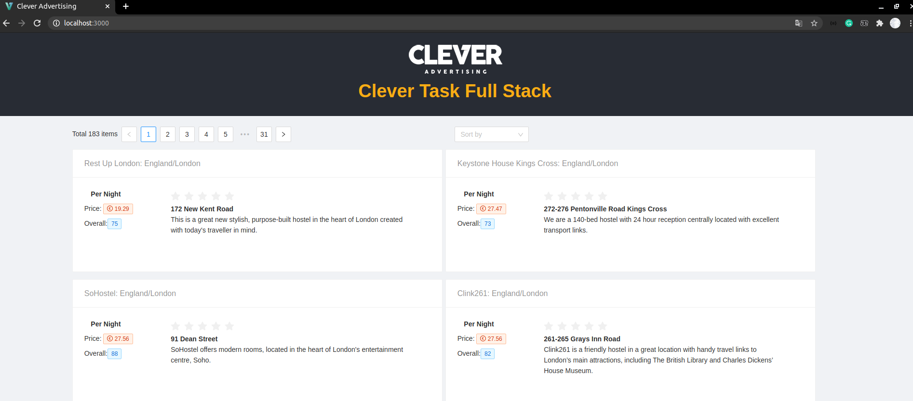
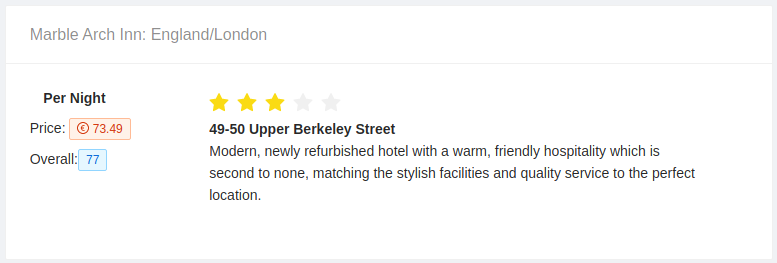
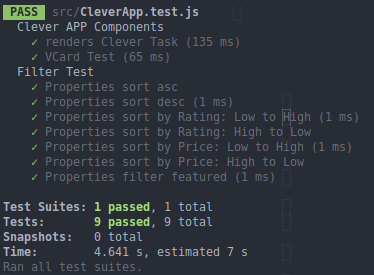
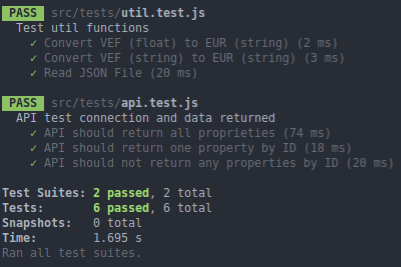

---

## Description
 Full Stack Single Page Aplication using NodeJS and ReactJs


 ### Requirements:
- Node version => node:slim
- Docker and Docker Compose

### How to works

Run within project folder:
```bash
$ docker-compose up
```
Use `make` or `make clean` command to clear frontend and backend projects:
```bash
$ make
```
  
 ### Frontend
 Used ReactJS and Ant Designer



- Card used:


**Developed functions:**
- Pagination
- Filter by features (*overallRating*, *isFeatured*, and *lowestPricePerNight*)

 **Tech informations:**

- PORT: 3000

### Backend

Used ExpressJS, Cors e Morgan (debugger)


#### Resources

> `GET /` -> Get message"API Clever Advertising" 
> `GET /property` -> Get all ads. Return array of ads
> `GET /property/id` -> Get ads by id. Return one ads


 **Tech informations:**
- PORT: 5000


 ### Test 

 Used jest.js


 - To test Frontend app:

```bash
$ docker-compose up
$ docker-compose exec frontend sh -c "npm test"
```



- To test Backend app:

```bash
$ docker-compose up
$ docker-compose exec backend sh -c "npm test"
```



 