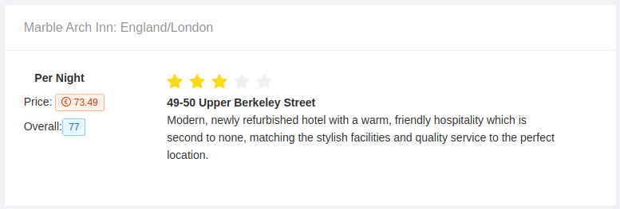

 ### Frontend
 Used ReactJS and Ant Designer


- Card used:


**Developed functions:**
- Pagination
- Filter by features (*overallRating*, *isFeatured*, and *lowestPricePerNight*)

 **Tech informations:**

- PORT: 3000

#### Test

 Used jest.js


 - To test Frontend app:

```bash
$ docker-compose up
$ docker-compose exec frontend sh -c "npm test"
```

